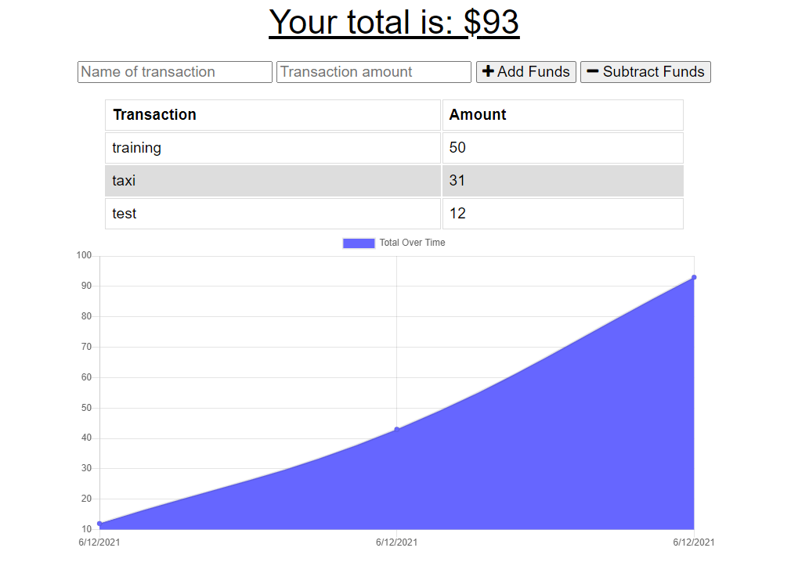

# Budget Tracker
[](https://opensource.org/licenses/MIT)

## Description  
A progressive budget app built with progressive web features to run the application offline and sync pending items with backend when online using
service worker, manifest and IndexedDB.

**LIVE URL:** https://aqueous-shelf-92064.herokuapp.com/



## Table of Contents

- [Used-Technologies](#Used-Technologies)<br>
- [Installation](#Installation)<br>
- [Usage](#Usage)<br>
- [License](#License)<br>
- [Questions](#Questions)

## Used-Technologies
- NodeJS
- Express
- MongoDB Atlas
- Mongoose
- Heroku
- PWA (Service Worker, Manifest & IndexedDB)


## Installation  
- clone the project
- Open terminal
- change directory to the project directory
- run below: <br>
```
npm i
```

## Usage 
- Open
- change directory to the project directory
- run below: <br>
```
npm start
```
## License

[MIT](https://opensource.org/licenses/MIT)


## Questions
Github: [@riheelh](www.github.com/riheelh) <br>
